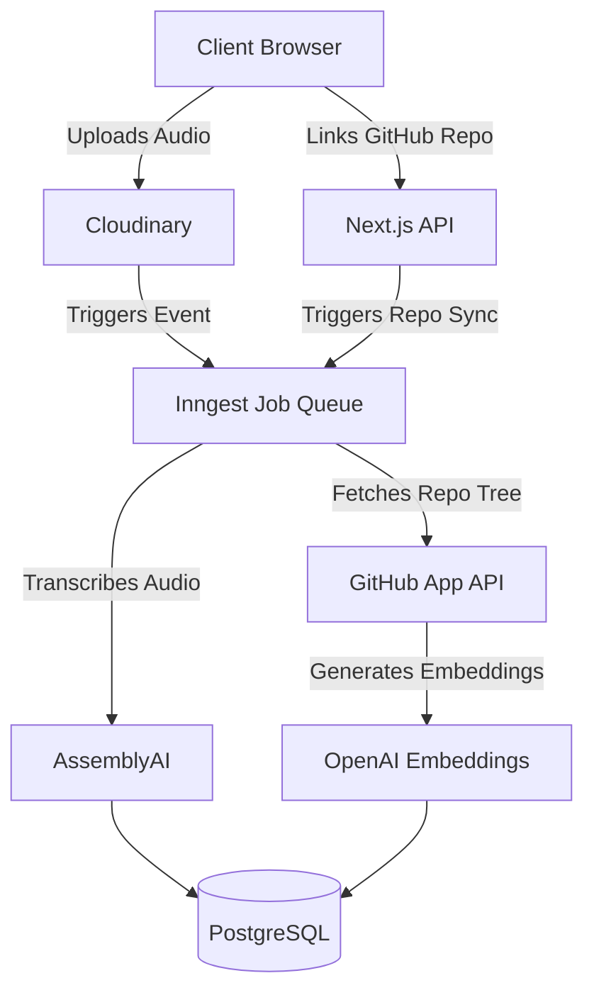

# GitVizor

[](https://github.com/nitingupta95/gitvizor/actions/workflows/ci.yml)
[](https://opensource.org/licenses/MIT)

> An AI-powered SaaS application that bridges the gap between raw GitHub repository data and developer meetings via RAG codebase Q&A and audio transcription analysis.

<!-- 
🚨 TODO FOR REPO OWNER: RECORD A DEMO GIF/VIDEO 🚨 
Please record a 30-45 second video or GIF of the following flow and place it here:
1. Sign in via Clerk
2. Connect a repository (e.g. nitingupta95/SPMS)
3. Ask a question in the "Ask GitVizor" chat.
4. Show the streamed response and file references.
Replace the image tag below with your recorded demo.
-->


[Read the Technical Case Study (Architecture & Decisions) 📖](./CASE_STUDY.md)

## 🧩 Project Overview
GitVizor is a full-stack, production-ready SaaS designed to handle user authentication, credit-based subscription management, and repository intelligence.
It allows users to ingest GitHub repositories to ask contextual questions about their codebase and upload developer meetings to automatically extract action items and summaries.

## 🚀 Tech Stack
- **Frontend**: Next.js 15 (App Router), React 19, Tailwind CSS v4
- **Backend Architecture**: Next.js Serverless API Routes + tRPC
- **Database**: PostgreSQL (Neon.tech) with Prisma ORM & `pgvector`
- **Auth & Security**: Clerk (Auth) & Upstash Redis (Rate Limiting)
- **Background Jobs**: Inngest (Audio Processing & GitHub Polling)
- **AI Integration**: OpenAI, Google Gemini (Fallback), AssemblyAI, Vercel AI SDK
- **Billing**: Stripe API & Webhooks
- **Observability**: Sentry (Error Tracking) & Pino (Structured JSON Logging)
- **Storage**: Cloudinary / Firebase

## 📦 Features
- ✅ Multi‑tenant architecture with Clerk Auth
- ✅ Credit-based billing and Stripe subscription management
- ✅ GitHub Repository Ingestion & real-time commit tracking via GitHub Apps
- ✅ RAG-powered Codebase Q&A with strict IDOR protections
- ✅ Developer meeting audio upload and AI extraction via Inngest background jobs
- ✅ Streaming AI responses with automatic OpenAI -> Gemini fallback
- ✅ API rate-limiting via Upstash Redis

## 🛠️ Architecture

### Core Data & Q&A Flow
```mermaid
graph TD
    Client[Client Browser] -->|Ask Code Question| API[Next.js API / tRPC]
    
    API -->|Rate Limit Check| Redis[(Upstash Redis)]
    API -->|Vector Search Context| DB[(PostgreSQL / pgvector)]
    DB --> API
    
    API -->|Primary| OpenAI[OpenAI gpt-4o-mini]
    API -.->|Fallback (429/5xx)| Gemini[Gemini 1.5-flash]
    
    OpenAI --> SDK[Vercel AI SDK]
    Gemini --> SDK
    SDK -->|Streaming Response| Client
```

### GitHub Ingest & Audio Processing Pipeline (Background Jobs)


## 🚀 Getting Started

### Prerequisites
- Node.js (>=18)
- pnpm (recommended for this workspace)
- PostgreSQL database (e.g., Neon.tech) with `pgvector` extension
- API Keys for Clerk, Stripe, GitHub, OpenAI, Gemini, AssemblyAI, and Cloudinary

### Installation
```bash
git clone https://github.com/nitingupta95/gitvizor.git
cd gitvizor
pnpm install
```

### Configuration
Copy the `.env.example` file to `.env` and fill in your keys.

### Database Setup
Run migrations and generate the Prisma client:
```bash
pnpm db:generate
pnpm db:push
```

### Run Locally
```bash
# Terminal 1: Run the Next.js dev server
pnpm dev

# Terminal 2: Run the Inngest dev server for background jobs
npx inngest-cli@latest dev
```  
App will be available at `http://localhost:3000`.

### Build for Production
```bash
pnpm build
pnpm start
```

## 🧑‍💻 Contributing
Contributions are always welcome!
1. Fork the repository
2. Create a branch (`git checkout -b feature/YourFeature`)
3. Commit your changes
4. Push to your fork
5. Open a Pull Request

## 📄 License
Licensed under the [MIT License](LICENSE).

---
Made with ❤️ by [Nitin Gupta](https://github.com/nitingupta95)
