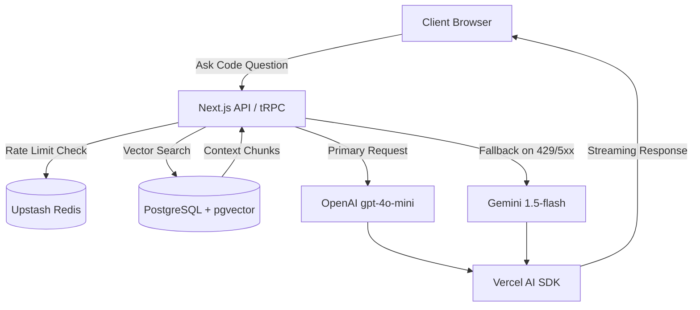
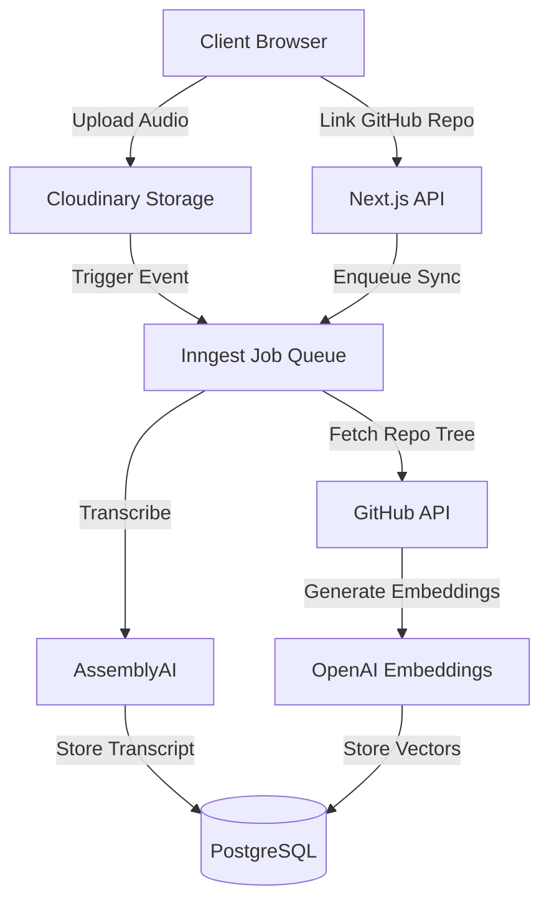
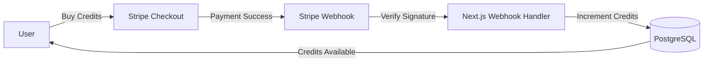

<div align="center">

# 🔮 GitVizor

### AI-Powered GitHub Repository Intelligence Platform

[](https://github.com/nitingupta95/githubSaas/actions)
[](https://opensource.org/licenses/MIT)
[](https://nextjs.org/)
[](https://www.typescriptlang.org/)
[](https://github-saas-zeta.vercel.app)

**[🚀 Live Demo](https://github-saas-zeta.vercel.app) · [📖 Case Study](./docs/CASE_STUDY.md) · [🐛 Report a Bug](https://github.com/nitingupta95/githubSaas/issues)**

</div>

---

GitVizor transforms any GitHub repository into a searchable, AI-powered knowledge base. Connect a repo, ask questions about your codebase using RAG, track commits in real-time, transcribe developer meetings, and collaborate — all in one production-ready SaaS platform.

---

## ✨ Features

| Feature | Description |
|---|---|
| 🤖 **RAG Codebase Q&A** | Ask natural-language questions about any GitHub repo. Context is retrieved via pgvector semantic search and fed to GPT-4o-mini (with Gemini 1.5-flash fallback) |
| 🌿 **Commit Tracking** | Real-time GitHub commit polling with AI-generated summaries per commit |
| 🎙️ **Meeting Intelligence** | Upload developer meetings; AssemblyAI transcribes them and AI extracts action items |
| 📚 **AI Wiki Generator** | Automatically generates a structured technical wiki/guide for any connected repository |
| 👥 **Team Collaboration** | Invite teammates to projects; shared Q&A history and meeting access |
| 🔗 **Public Share Links** | Share AI-powered repo Q&A with anyone via a public token link |
| 💳 **Credit-Based Billing** | Stripe-powered credit system — pay per file indexed |
| 🛡️ **Rate Limiting** | Per-user API rate limiting via Upstash Redis |
| 🔍 **Observability** | Full Sentry error tracking + structured JSON logging via Pino |

---

## 🛠️ Tech Stack

### Frontend
- **[Next.js 15](https://nextjs.org/)** (App Router + Turbopack) — React 19, Server Components, Streaming
- **[Tailwind CSS v4](https://tailwindcss.com/)** — Utility-first styling with dark mode & glassmorphism
- **[tRPC](https://trpc.io/)** — End-to-end type-safe API layer
- **[Clerk](https://clerk.com/)** — Authentication, multi-tenant user management

### Backend & Data
- **[PostgreSQL](https://www.postgresql.org/)** (Neon.tech) + **[Prisma ORM](https://www.prisma.io/)** + **[pgvector](https://github.com/pgvector/pgvector)** — Vector similarity search
- **[Inngest](https://www.inngest.com/)** — Durable background jobs (repo indexing, audio processing)
- **[Upstash Redis](https://upstash.com/)** — Serverless rate limiting

### AI & External Services
- **[OpenAI](https://openai.com/)** (GPT-4o-mini + text-embedding-3-small) — Primary AI provider
- **[Google Gemini](https://ai.google.dev/)** (1.5-flash) — Automatic fallback on 429/5xx errors
- **[AssemblyAI](https://www.assemblyai.com/)** — Meeting audio transcription
- **[Vercel AI SDK](https://sdk.vercel.ai/)** — Unified streaming interface
- **[Stripe](https://stripe.com/)** — Payments & webhooks
- **[Cloudinary](https://cloudinary.com/)** — Audio/media storage
- **[Sentry](https://sentry.io/)** — Error monitoring & performance tracing

---

## 🏗️ Architecture

### RAG Codebase Q&A Flow



### GitHub Ingest & Audio Processing Pipeline



### Credit & Billing Flow



---

## 🚀 Getting Started

### Prerequisites

- Node.js `>= 18`
- `pnpm` package manager
- PostgreSQL database with `pgvector` extension (e.g. [Neon.tech](https://neon.tech))
- API keys for all services (see `.env.example`)

### 1. Clone & Install

```bash
git clone https://github.com/nitingupta95/githubSaas.git
cd githubSaas
pnpm install
```

### 2. Environment Setup

```bash
cp .env.example .env
```

Fill in your keys — see [Environment Variables](#-environment-variables) below.

### 3. Database Setup

```bash
# Push schema to database
pnpm db:push

# Generate Prisma client
pnpm db:generate
```

### 4. Run Locally

```bash
# Terminal 1 — Next.js dev server
pnpm dev

# Terminal 2 — Inngest background job server
npx inngest-cli@latest dev
```

App: `http://localhost:3000`  
Inngest Dev UI: `http://localhost:8288`

---

## 🔑 Environment Variables

Create a `.env` file from `.env.example`. Here are the required keys:

| Variable | Description |
|---|---|
| `DATABASE_URL` | PostgreSQL connection string (pooled) |
| `DIRECT_URL` | PostgreSQL direct connection (for migrations) |
| `CLERK_SECRET_KEY` | Clerk backend secret key |
| `NEXT_PUBLIC_CLERK_PUBLISHABLE_KEY` | Clerk publishable key |
| `GEMINI_API_KEY` | Google Gemini API key |
| `OPENAI_API_KEY` | OpenAI API key |
| `ASSEMBLYAI_API_KEY` | AssemblyAI API key |
| `STRIPE_SECRET_KEY` | Stripe secret key |
| `STRIPE_WEBHOOK_SECRET` | Stripe webhook signing secret |
| `CLOUDINARY_CLOUD_NAME` | Cloudinary cloud name |
| `CLOUDINARY_API_KEY` | Cloudinary API key |
| `CLOUDINARY_API_SECRET` | Cloudinary API secret |
| `GITHUB_TOKEN` | GitHub personal access token (for repo access) |
| `NEXT_PUBLIC_APP_URL` | Your deployed app URL (e.g. `https://github-saas-zeta.vercel.app`) |
| `UPSTASH_REDIS_REST_URL` | *(Optional)* Upstash Redis URL for rate limiting |
| `UPSTASH_REDIS_REST_TOKEN` | *(Optional)* Upstash Redis token |

> See [`.env.example`](./.env.example) for the full list with descriptions.

---

## 📁 Project Structure

```
src/
├── app/
│   ├── (protected)/          # Authenticated pages
│   │   ├── dashboard/        # Main dashboard, commit log, Q&A card
│   │   ├── meetings/         # Meeting upload & transcript viewer
│   │   ├── guide/            # AI-generated wiki for repo
│   │   ├── qa/               # Q&A history page
│   │   ├── billing/          # Credit management & Stripe checkout
│   │   └── settings/         # Project settings & public share
│   ├── (public)/             # Public share pages (no auth required)
│   ├── api/                  # API routes (webhooks, inngest, upload)
│   └── page.tsx              # Landing page
├── server/
│   └── api/routers/          # tRPC routers (project, guide, meeting)
├── lib/
│   ├── ai/                   # OpenAI + Gemini AI utilities
│   ├── github/               # GitHub API, commits, repo loader
│   └── third-party/          # Cloudinary, AssemblyAI, Firebase
├── inngest/                  # Background job definitions
├── hooks/                    # React hooks (useProject, useRefetch)
└── styles/                   # Global CSS & design tokens
```

---

## 🚢 Deployment

This project is optimized for **[Vercel](https://vercel.com)** deployment.

1. Push to GitHub
2. Import repo in Vercel
3. Add all environment variables in **Vercel → Settings → Environment Variables**
4. Deploy

> **Important:** Set up a **Stripe Webhook** pointing to `https://your-domain.vercel.app/api/webhook/stripe` with the `checkout.session.completed` event and update `STRIPE_WEBHOOK_SECRET` with the dashboard signing secret.

---

## 🤝 Contributing

Contributions are welcome!

1. Fork the repository
2. Create your feature branch: `git checkout -b feature/amazing-feature`
3. Commit your changes: `git commit -m 'feat: add amazing feature'`
4. Push to the branch: `git push origin feature/amazing-feature`
5. Open a Pull Request

---

## 📄 License

Licensed under the [MIT License](LICENSE).

---

<div align="center">

Made with ❤️ by [Nitin Gupta](https://github.com/nitingupta95)

⭐ **Star this repo** if you find it useful!

</div>
